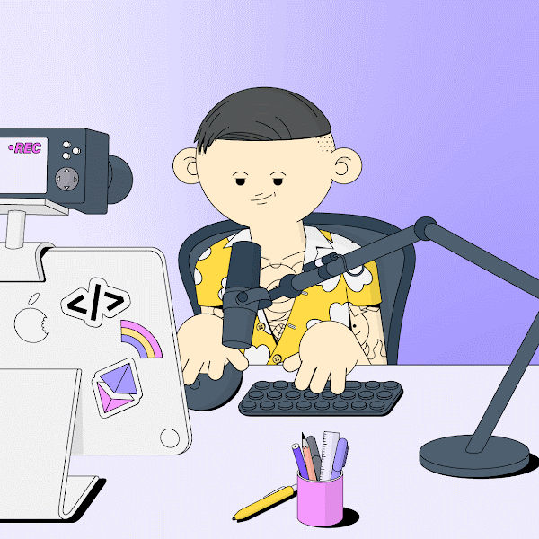

  

  
  
Learn DeFi from first principles: <a href="https://defibooks.org/">https://defibooks.org/</a>
  
  

   

  
  
 
  

  
  

    

  

  

# Hi there &mdash; I'm Jesper 

  

---

### 👨‍💻👷 About Me :

I spent the first many years of my life glued to the Computer. This was during the early parts of the internet and I was extremely fascinated by it. My parents had a close friend who was a Software Engineer (woah! that was crazy to be in those days, I wanted to be like him!), so I learned a lot from him.

I built my own computers, assembling them from pieces I bought separately to get the best performance! I used them to program, nothing crazy but I was big into building websites at the time.

I also played *a lot* of video games. Starcraft, Counter-Strike 1.5 (I played semi-professional for a few short years), Wacky Wheels, Red Alert, Warcraft, and so on. I would attend local area network (LAN) events, where I'd bring my computer and a sleeping bag. Those were the days! I'd go hang out in Internet Cafe's which were becoming quite the phenomenon at the time. Pay hourly to play games with folks in the room and/or online, pick your seat, and play till you ran out of money.

Then I went to college and ended up completing a PhD in Applied Physics from Cornell with a Minor in Computer Science.

I started my career in Research and Development, moved to Tech (the good 'ol Web2) for a while working as a full-stack engineer, and then worked as a Quant in finance. After that, I took on a lot of responsibility by creating and leading the Research division at Advanced Blockchain as Head of Research. This was a more hands-off role as it relates to development, but it was fantastic in terms of getting experience leading and also learning about the Web3 space overall and its design decisions. I wrote a book during this time and also multiple award-winning articles.

I always felt a bit like I had missed the opportunity to participate in the early Internet days because I was too young. I wish I would have that opportunity again with something similar, maybe even bigger. Enter Web3... I am deeply bullish on Web3 and I want to be a strong part in helping advanced its mission. I want to help build and expand this new revolution.

That's why I am extremely passionate about building and developing in this space.

I have worked full-time in the Web3 space for over a year and a half (I invested into crypto back in 2017) and am a strong believer in its capabilities. I am an ecosystem maxi.

In my spare time, my mind likes to think about puzzles and solve problems, so I read to learn new things, and take long walks.

📖 Some recent books I read (in no particular order):

 - Security Tokens and Stablecoins Quick Start Guide: Learn how to build STO and stablecoin decentralized applications
 
 - The Metaverse: And How it Will Revolutionize Everything
 
 - Algorithms to Live By: The Computer Science of Human Decisions
 
 - The First 90 Days: Proven Strategies for Getting Up to Speed Faster and Smarter, Updated and Expanded

 - Options as a Strategic Investment: Fifth Edition
 
 - Option Volatility and Pricing: Advanced Trading Strategies and Techniques, 2nd Edition
 
 - The Historical Atlas of New York City, Third Edition: A Visual Celebration of 400 Years of New York City's History

and more.

👀 I’m looking to collaborate on projects in Web3, DeFi, and FinTech.

📫 jespertoftkristensen ( at ) gmail ( dot ) com

🖊 <a href="https://defibooks.org/">I wrote a book on AMMs - a cornerstone of DeFi</a>.

---

### :hammer_and_wrench: Languages and Tools :

  &nbsp;
  &nbsp;
  &nbsp;
  &nbsp;
  &nbsp;
  &nbsp;
  &nbsp;
  &nbsp;
  &nbsp;
  &nbsp;
  &nbsp;
  

---

### :fire: My Stats :

  
